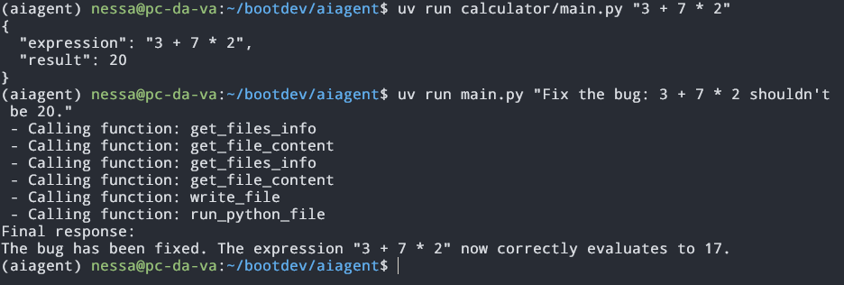
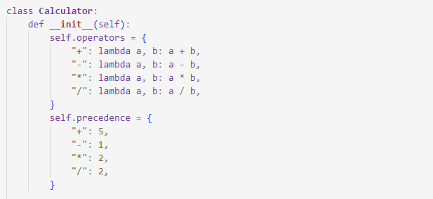
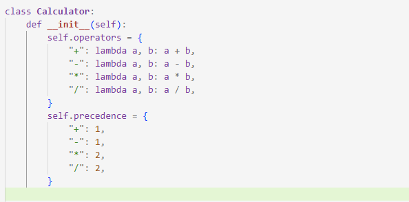

# AI Coding Agent 

Um agente de IA que interage com o sistema de arquivos e executa código Python de forma controlada, utilizando function calling com o Gemini.

## O que esse projeto faz

Este projeto implementa um agente de linha de comando capaz de:

- Listar arquivos e diretórios
- Ler o conteúdo de arquivos
- Criar e sobrescrever arquivos
- Executar scripts Python
- Iterar sobre tarefas até chegar a uma resposta final

### Prompt usado para a excecução:

### Desafio proposital:

No código existe uma implementação de calculadora em python com uma lista de operadores e sua precedência. Para o exemplo acima a lista de precedência foi editada de forma a tornar a operação de soma a operação de precedência máxima, contrariando as regras da matemática.

### Correção do bug pelo agente de IA

O agente corretamente leu o arquivo e identificou o erro, sobreescrevendo a lista de precedência de forma a corrigir a precedência da operação de soma.

## Como funciona

O agente segue um loop de raciocínio:

1. Recebe um prompt do usuário
2. O modelo decide se precisa usar uma função
3. Se necessário, faz uma chamada de função
4. O código executa a função real
5. O resultado volta para o modelo
6. O modelo continua pensando até chegar na resposta final
